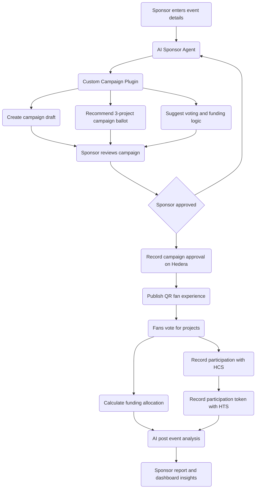

# Nature Backers Sponsor Agent

AI-powered sponsor workflow agent for participatory sustainability campaigns tied to women’s sports, live fan engagement, and verified sustainability projects.

## Overview

Nature Backers Sponsor Agent helps sponsors design, approve, launch, and analyze sustainability fan engagement campaigns connected to live women’s sports events.

The project builds on the Nature Backers Hedera Apex Hackathon prototype, which demonstrated QR-based fan participation, project voting, funding unlocks, HCS participation records, proof-of-participation concepts, and sponsor dashboard concepts.

For Week 2, this project adds an AI Sponsor Agent and custom campaign plugin that support enterprise sponsor workflows before and after an event.

## Hedera AI Bounty Focus

**Week 2: Enterprise Agent + Plugin**

This submission demonstrates:

- an AI-powered sponsor campaign agent
- a custom Nature Backers campaign plugin
- human-in-the-loop sponsor approval
- Hedera Agent Kit integration
- HCS records for campaign or participation activity
- HTS proof-of-participation or sponsor engagement token activity
- AI-assisted post-event reporting

## What This Prototype Demonstrates

The Week 2 prototype models a sponsor-funded sustainability activation.

A sponsor defines a campaign funding pool, reviews AI-generated campaign recommendations, approves a campaign, and then receives a post-event report based on fan participation and voting outcomes.

The prototype is designed to show:

- campaign creation before a live event
- project ballot recommendation
- sponsor approval workflow
- campaign or participation records on Hedera
- proof-of-participation token activity
- funding allocation logic based on fan voting
- sponsor-facing reporting after the event

## Example Use Case: Women’s Flag Football Night

A sponsor wants to activate a sustainability campaign during a women’s flag football event in San Francisco.

Sponsor inputs:

- event type: Women’s Flag Football Night
- location: San Francisco
- campaign goal: climate resilience and local community engagement
- sponsor sustainability pool: $5,000
- audience objective: fan participation during the live event

The Sponsor Agent generates:

- campaign concept
- curated 3-project sustainability ballot for fan voting
- fan-facing messaging
- SDG and project rationale
- voting mechanics
- funding unlock thresholds
- lightweight Hedera participation workflow

The sponsor reviews and approves the campaign before launch.

## Human-in-the-Loop Approval

The agent does not autonomously launch campaigns or move sponsor funds.

Sponsors review and approve:

- project selections
- funding pool
- voting structure
- campaign messaging
- funding allocation logic
- Hedera transaction actions

Only approved actions proceed to execution.

## Custom Campaign Plugin

The custom Nature Backers campaign plugin exposes sponsor workflow actions to the AI agent.

Example plugin functions:

- `createCampaignDraft`
- `recommendProjectBallot`
- `approveCampaign`
- `publishCampaign`
- `recordFanParticipation`
- `calculateFundingAllocation`
- `generateSponsorReport`

The plugin connects the AI agent to campaign data, project selection, sponsor approval, fan participation, and reporting logic.

## Hedera Integration

This prototype uses Hedera Agent Kit to support real testnet actions.

Planned Hedera actions include:

- HCS message submission for campaign approval or fan participation records
- HTS token activity for proof-of-participation or sponsor engagement tokens
- Guardian Indexer APIs or verified sustainability project metadata
- transparent campaign workflow records for sponsor reporting

## Workflow Diagram

The prototype follows a human-in-the-loop workflow where the AI agent recommends a campaign, the sponsor approves it, and Hedera records campaign and participation activity.

## Demo Flow

1. Sponsor enters event and campaign details.
2. AI Sponsor Agent recommends a campaign concept and 3-project ballot for fan voting.
3. Sponsor reviews and approves the campaign.
4. Campaign approval is recorded through a Hedera workflow.
5. Fan participation and voting are simulated.
6. Proof-of-participation or campaign activity is recorded.
7. Funding allocation logic is calculated from voting outcomes.
8. AI Sponsor Agent generates a post-event sponsor report.

### Guardian Project Data

For this Week 2 prototype, the example sustainability projects may be curated sample projects unless real Guardian Indexer project records are available for the demo.

The intended Guardian integration is for the Sponsor Agent to query Guardian Indexer APIs or Guardian-aligned metadata to retrieve verified project attributes such as:

- project name
- project ID, if available
- policy ID or methodology, if available
- location
- project category
- SDG alignment
- verification or token status
- registry/source reference, if available

The sample projects in this README are used to demonstrate the sponsor workflow and project ballot experience. They should not be interpreted as live Guardian-verified projects unless Guardian project records are explicitly linked.

## Example Sustainability Projects

The following are sample projects used to demonstrate the campaign ballot experience. They may be replaced with live Guardian Indexer project records if available for the demo.

### Bay Watershed Restoration Initiative

**Category:** Water Conservation / Ecosystem Restoration

Restores native vegetation and improves water quality across local river basins that feed into the San Francisco Bay.

**Relevant SDGs:**

- Clean Water and Sanitation
- Climate Action
- Life on Land

### Urban Cooling Tree Network

**Category:** Urban Climate Resilience

Expands urban tree canopy across Bay Area neighborhoods to reduce heat, improve air quality, and support biodiversity.

**Relevant SDGs:**

- Sustainable Cities and Communities
- Climate Action
- Good Health and Well-being

### Coastal Habitat Recovery Program

**Category:** Biodiversity Restoration

Restores native plants and habitats along the California coast to support pollinators, birds, and resilient coastal ecosystems.

**Relevant SDGs:**

- Life Below Water
- Life on Land
- Climate Action

## AI-Assisted Reporting

After the campaign, the Sponsor Agent analyzes:

- fan participation levels
- project voting outcomes
- funding thresholds reached
- proof-of-participation activity
- SDG and community resonance
- event-level engagement trends

The agent generates sponsor-facing reporting to help sponsors understand what fans engaged with and how future campaigns could be improved.

## Prior Hedera Apex Hackathon Work

This project builds on the earlier Nature Backers Apex prototype:

https://github.com/CarbonSustain/nature-wired-apex

The Apex prototype demonstrated QR-based fan participation, project voting, funding unlock concepts, HCS participation records, proof-of-participation concepts, and sponsor dashboard concepts.

## Concept Prototype

Sponsor Advisor GPT:

https://chatgpt.com/g/g-69c570bf989c81918a48712fe6358365-nature-backers-sponsor-advisor

## Vision

Nature Backers explores how AI agents, participatory fan experiences, and Hedera infrastructure can transform sponsorship into transparent, community-driven sustainability engagement.
